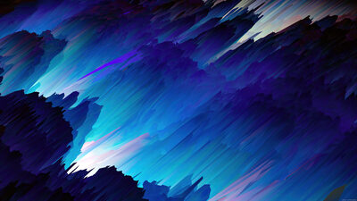
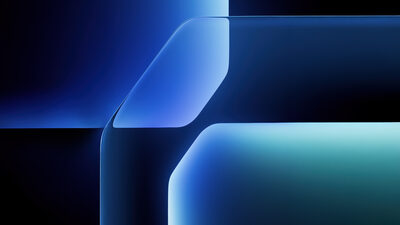
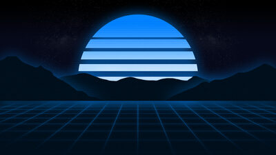
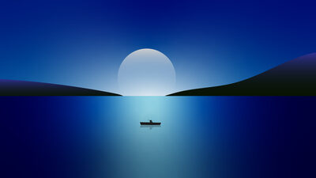
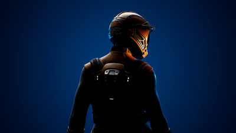

<p align="center">
  
</p>

<h1 align="center">Ocean Night</h1>

<p align="center">
  <em>A deep-navy, ocean-blue theme for <a href="https://omarchy.org">Omarchy</a> —
  rounded every corner, a quiet motion for switching windows, and a cursor that writes.</em>
</p>

<p align="center">
  
  
  
</p>

---

## Install

```bash
omarchy theme install https://github.com/hembramnishant50-glitch/omarchy-ocean-night-theme.git
omarchy theme set "Ocean Night"
```

Verify with `omarchy theme current` — it should report **Ocean Night**.

---

Built from a set of midnight-blue abstract wallpapers, *Ocean Night* pulls the
whole desktop into one calm palette — the boot lock screen, the shell, the
editor, and the terminal all read as the same quiet stretch of water after
dark.

## What you get

- **Full-screen corners** — every shell surface (bar, launcher, menus,
  notifications, lock screen) follows `decoration:rounding = 16`, so the whole
  desktop shares one radius instead of a mixed bag.
- **Quiet motion** — workspace switches slide (`slidefade 20%`), focused windows
  fade in; both on the same easy-out curve as the rest of the system.
- **A cursor that writes** — kitty uses a beam cursor with a gentle blink and a
  `cursor_trail` so text feels *typed*, one line of characters chasing the caret.
- **Editor themes** — Helix, Vim, Emacs, Sublime Text, Zed, and the
  VS Code / Cursor / VSCodium family all get an Ocean Night skin.
- **App configs** — btop, chromium, firefox (`firefox/userChrome.css`), obsidian,
  neovim, pi, t3code, and the shell itself.
- **Five wallpapers** — a numbered set in `backgrounds/`, cycled with the theme.

## Wallpapers

| | | |
| :--- | :--- | :--- |
|  |  |  |
| *abstract blue wave* | *blue geometric* | *blue aesthetic* |
|  |  |  |
| *moonlit boat at sea* | *satisfactory factory* | full-size files in `backgrounds/` |

Cycle the bundled wallpapers any time with `omarchy theme bg next`.

## Palette

| Role | Hex | Swatch |
| :--- | :--- | :--- |
| darker background | `#02040C` |  |
| dark background | `#040816` |  |
| background | `#050A2D` |  |
| lighter / selection | `#0E285B` |  |
| muted | `#245D9A` |  |
| accent | `#4995DD` |  |
| foreground | `#AAC5DD` |  |
| light foreground | `#86CEE8` |  |
| bright foreground | `#E4F2FC` |  |

| Syntax | Hex | Swatch |
| :--- | :--- | :--- |
| cyan | `#3FD4E8` |  |
| green | `#63D1A7` |  |
| yellow | `#E8C47F` |  |
| orange | `#EF9766` |  |
| red | `#F1758A` |  |
| magenta | `#C678DD` |  |
| brown | `#70604C` |  |

A brighter terminal set (`bright_red` `#FF91A0`, `bright_yellow` `#F5D99E`,
`bright_green` `#8FE8C4`, `bright_cyan` `#6FE4F2`, `bright_blue` `#6FB4F2`,
`bright_magenta` `#DA9AF0`) is included for shell prompts and PS1 segments.

---

<p align="center">Made for <a href="https://omarchy.org">Omarchy</a> · Ocean Night</p>